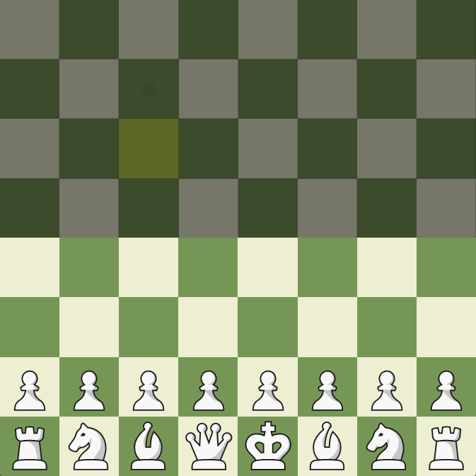
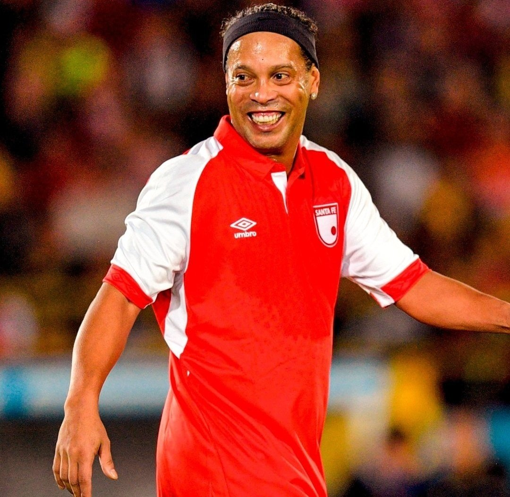

## TABLE OF CONTENTS

- [(0.0.0) - The big picture and RL Learning Framework](2024-05-30-hugging-face-rl-course.md#000-the-big-picture-and-rl-learning-framework)
	- [(0.0.1) - RL Process](2024-05-30-hugging-face-rl-course.md#000-the-big-picture-and-rl-learning-framework)
	- [(0.0.2) - Markov Property, Markov Decision Process](2024-05-30-hugging-face-rl-course.md#000-the-big-picture-and-rl-learning-framework)

## (0.0.0) - INTRODUCTION TO DEEP RL

### (0.1.0) - THE BIG PICTURE AND RL LEARNING FRAMEWORK

The big idea behind reinforcement learning is that an agent will be able to learn from an environment by *interacting with it*. Interaction leads to rewards (which can either be negative (punishment) or positive) that serve as *feedback*, informing future decisions. For example, imagine you have a little brother and you sit him in front of a videogame he's never seen nor played. He'll probably start off by figuring his way around the controls. Maybe he manages to collect a prize which increases his score, or, on the contrary, comes into contact with an enemy, thereby reducing his score. Through interaction, he learns about the environment. 

#### (0.1.1) - RL PROCESS
The process described above can be modeled as follows: 

*Source: Hugging Face Deep RL Course - Unit 1 - "RL Framework"*

We encounter a loop: An agent interacts with a given state (say, the world a specific moment in time / with a specific organization (set of information)), which is related to (or involves / or comes with) a reward[^1]. The agent then takes a decision based on these, thereby changing the environment through its action, resulting in a new state and a new reward. This ultimately ends up being a loop involving an agent, states (\\( S_t \\), \\( S_{t+1} \\), \\( \dots \\), \\( S_n \\) ), actions (\\( A_t \\), \\( A_{t+1} \\), \\( \dots \\), \\( A_n \\) ) and rewards (\\( R_t \\), \\( R_{t+1} \\), \\( \dots \\), \\( R_n \\) ).

Reinforcement learning is based on the *reward hypothesis*: 

>"All of what we mean by goals and purposes can be well thought of as maximization of the expected value of the cumulative sum of a received scalar signal (reward)"
>
>*(Sutton, 2004; Sutton & Barto, 2018; Littman, 2017).*

In other words, we can express the agent's goal as a maximization problem, the maximization of its reward. This entails that we'd have to make sure our environment is set up / expressed in such a way that it's able to capture this dynamic. For instance, consider we're trying to teach our agent how to score a goal[^2]. To do so, we'd have to make sure our agent has access to a set of actions that can allow it to satisfy such a goal (say, moving in a given direction, kicking, etc.), and that it receives information (a new state and a reward) based on the action it takes. Furthermore, this information is specified, such that, if the agent attempts to choose reward maximizing actions, it will lead closer to the completion of the goal (hopefully up to the full completion of the goal). Enough with the abstractions, back to our football example. In this case, since we want our agent to score a goal, we might reward it when the ball is closer to goal and punish it when it's further away. In this sense, as our agent is trying to maximize the reward, it might try strategies (such as kicking the ball when its facing the goal) that result in the ball being as close to goal as possible (until it's ultimately in goal). 

#### (0.1.2) - MARKOV DECISION PROCESS
This RL process we've just discussed is called a [Markov Decision Process (MDP)](https://en.wikipedia.org/wiki/Markov_decision_process)[^3]. An MDP is a framework used to describe sequential decision making. We'll have enough time to get into the nitty gritty later on[^7], for now, let's dive a little deeper into the formalization of a MDP. 

#### (0.1.3) - OBSERVATION/STATE SPACES
Observations/States are the information that represents the 'world/environment' at a given moment in time[^8], this could be a given frame in a video game, in our football example, it might be a slice of time with a set of corresponding variables at certain variables, say for instance, our first possible state might be kickoff where both our agent and ball have a certain position. The collection of all possible states (imagine, the universe of possible states) is called the state space \\( S \\). Now, there's a slight distinction between states and observations. A state is a complete description of the world (there is no hidden information), like a chessboard for instance, at a given slice in time you know where every piece is and who's turn it is. On the other hand, an observation is a partial description of the state of the world, it's a partially observed environment. Imagine you're playing a game of fog chess / fog of war, at a given moment in time, you probably don't have all the information about the world (where each piece is)

#### (0.1.4) - ACTION SPACES
The action space \\( A \\) is the set of all possible actions. Not all actions will be equally available in all states, but all actions must still be a part of the action space, we can denote that the actions available for a given state \\( s \\) are \\( A(s) \\) and a subset \\( \subseteq \\) of \\( A \\). Actions can be either discrete or continuous. A discrete action space means that the total number of possible actions is finite (imagine how u can only move left, right, up and down in Mario), while in a continuous space it's infinite (imagine ur action is the angle at which u face the ball to kick it, without further specification, the angle could be 50°, or 50.1° or 50.12° and so on). 

Whether an action space is discrete or continuous is important as it influences the RL algorithm we choose (we'll talk about this later on).

#### (0.1.5)- REWARDS AND DISCOUNTING
As we mentioned before, rewards are crucial for RL as they serve as our feedback. The cumulative reward at each time step t can be written as:

\\[ R(\tau) = r_{t+1} + r_{t+2} + r_{t+3} + r_{t+4} + \cdots \\]
\\[ R(\tau) = \sum\limits_{k = 0}^{\infty} r_{t+k+1} \\]

Where \\( \tau \\) is the trajectory our agent takes though the state space as it interacts with the environment, our reward is a function of this trajectory \\( \tau = (s_{0}, a_{0}, s_{1}, a_{1}, \cdots, s_{T}, a_{T}) \\). 

Adding some form of reward discounting is common practice in RL. This is typically done through a discounting factor (\\( \gamma \\)) where \\( 0 \leq \gamma \leq 1 \\). Discounting is done for a few reasons, for instance, we can try and reflect the idea that a reward received sooner is preferred to one in the future (due to the future's inherent uncertainty). A discounting factor allows us to balance / tweak our agent's focus between short term and long term rewards. To see exactly how this works let's discount our rewards: 

\\[ R(\tau) = r_{t+1} + \gamma \cdot r_{t+2} + \gamma^2 \cdot r_{t+3} + \gamma^{3} \cdot r_{t+4} + \cdots \\]

\\[ R(\tau) = \sum\limits_{k = 0}^{\infty} \gamma ^{k} \cdot r_{t+k+1} \\]

As can be seen, if \\( \gamma = 0 \\), then all rewards except for \\( r_{t+1} \\) are discarded. On the other hand, if \\( \gamma = 1 \\), then future rewards are valued just as much as present rewards. Now, if \\( 0 \leq \gamma \leq 1 \\), then our cumulative will converge towards some value. 

### (0.2.0) - TYPE OF TASKS

## (1.0.0) - INTRODUCTION TO Q LEARNING
## (2.0.0) - DEEP Q LEARNING WITH ATARI GAMES

### (0.1.0) - THE BIG PICTURE AND RL LEARNING FRAMEWORK

A MDP is a discrete time stochastic control process. Let's unpack that: 

- *Discrete-time*: instead of thinking of time as continuous (say, the way in which an hour can be divided into minutes, and seconds, and each second can be divided into even smaller divisions, meaning, that between any two points in time there are infinitely more points in time), think of there being 'separate points in time', for example \\( t = 1, 2, 3, \dots n \\) where each value of \\( t \\) is a point in time. Time "jumps" from one to the next. 

- *Stochastic:* stochasticity[^4] is often used interchangeably with 'randomness'. The wiki page for 'stochastic' defines it as the 'property of being well described by a random probability distribution'. Let's break that down as well: a probability distribution is a mathematical function that tells us the probability of occurrence for different outcomes of a given phenomenon / experiment / process (just as its name states: it tells us how *probabilities* of occurrence are *distributed* for a given p/e/p[^5]. When something is stochastic, it can be expressed as a probability distribution, in turn this gives us information about the nature of the phenomenon, without exactly knowing what outcome we'll get. For example, consider a fair dice with six sides. We can model our dice rolls with a probability distribution, but that doesn't mean we can predict what face we'll get for any given dice roll (but we can, thanks to our probability distribution, have some idea about the nature of the phenomenon (as seen below))

*[Source](https://www.cantorsparadise.com/what-to-expect-when-throwing-dice-and-adding-them-up-5231f3831d7): Juan Luis Ruiz-Tagale - Cantor's Paradise on Medium*

- *Control*: in this context, we're referring to [control theory](https://en.wikipedia.org/wiki/Control_theory). Control theory seeks out to create a model / algorithm that will take a dynamical system (say a spacecraft or the economy) to a desired [state](https://en.wikipedia.org/wiki/Optimal_control) (say landing on the moon or maximizing employment). 

In other words, an MDP models decision making where: 
- Time is discrete
- Outcomes are stochastic 

This relates to [ggs](/writing/sickness-unto-death)

hh
Other shit like this entry [about](/writing/no-one-is-coming-to-save-you)

and other shit like

[Hi](Pasted image 20240530180557.png)
There can be quite a bit of terminology to unpack 
I'll try and delve into this deeper myself 
The RL process
yes

\\( text \\) 

\\( hi \\)
100
\\( 100 \\)

[stochastic](https://raw.githubusercontent.com/thomaspradae/thomaspradae.github.io/main/assets/images/posts/Screenshot%202024-05-30%20180322.png)

[^1]: In the case where it's the first interaction, the state \\( S_0 \\) would also have a reward, \\( R_0 \\), which tends to be 0. 
[^2]: [Football](https://www.youtube.com/watch?v=6TnKvlQ2h7s&ab_channel=Super6), or Soccer, for those from the states. 
[^3]: The course says it delves deeper into this later on, so we'll see, however, I wish to do so myself as well, so for now we'll have just a quick overview, and later on, depending on what the course covers, we'll see what needs to be specified further. 
[^4]: From the Greek (stokhos) which means to aim or guess
[^5]: I promise to dive deeper into this elsewhere, so there should probably be a link here, if there isn't, maybe I forgot to link it so it might be somewhere in `notes`
[^6]: Don't want to bite off more than we can chew rn. Consistency over everything. 
[^7]: RL fundamentals will be covered no matter what, however, since we're just on the first page and trying to get a general overview of how RL works, more in depth explanations will be linked in due time. 
[^8]: Discrete time that is.