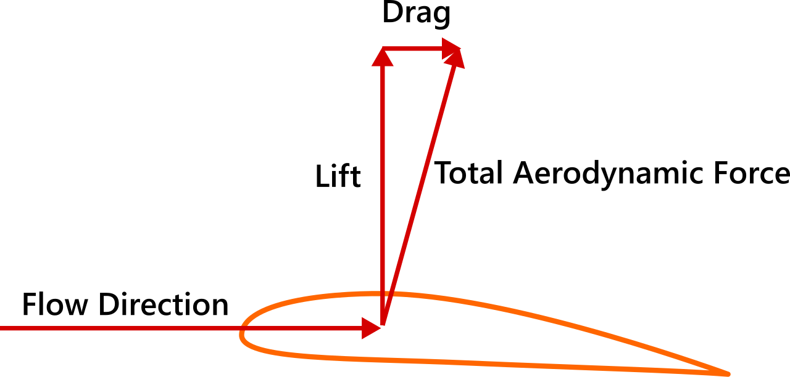
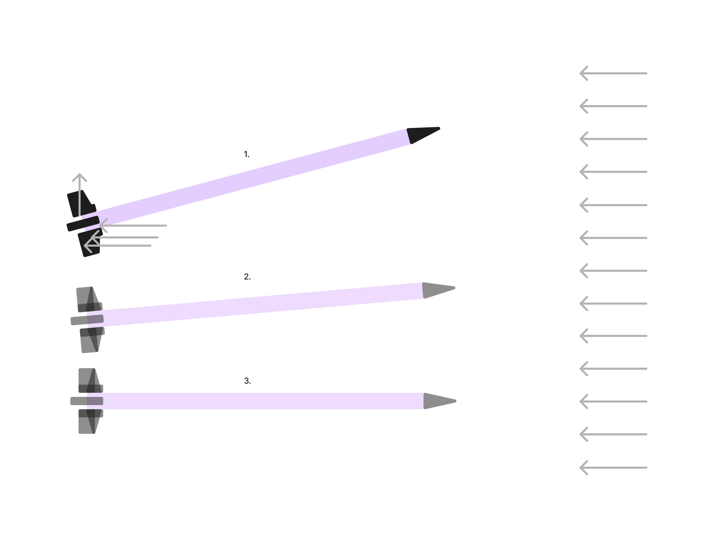
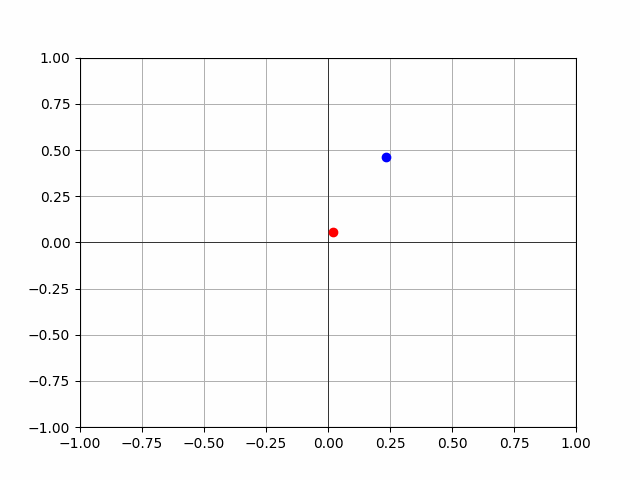
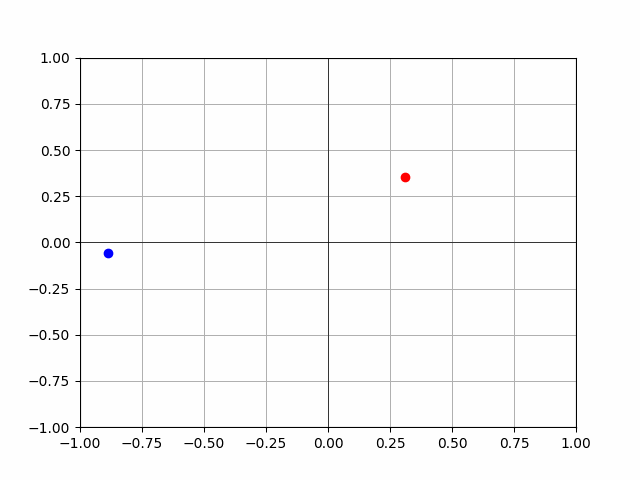

## (0) - NOTES

### (0.1) - v.3 - 3d model with rudimentary physics

#### (0.1.0) Background info

##### (0.1.0.1) - Theoretical Minimum Notes

Classical physics refers to physics before quantum mechanics. So stuff like Newton's equations of motion, Maxwell-Faraday theory of electromagnetic fields, the theory of general relativity. But it's more than just a few theories, it's rather, according to Susskind and Hrabovsky, a set of principles and rules, "a governing logic". An important characteristic of classical physics is the fact that if you know everything about a system at some instant of time, including the equations that govern the system (and how it changes), then it's possible to predict the future:

> The classical laws of physics are *deterministic*

If the same can be said about the past, then we would call this system a *reversible* system. As mentioned by S&H, determinism isn't enough for a dynamic law. (A system that changes with time is called a dynamical system. A dynamical system involves a *law of motion* or *dynamical law*, which is simply the rule that tells us the next given state given our current state). This idea is fundamental to classical physics, here's S&H:

> The rule that dynamical laws must be deterministic and reversible is so central to classical physics that we sometimes forget to mention it when teaching the subject. In fact, it doesn't even have a name. We could call it the first law, but unfortunately there are already two first laws—Newton's and the first law of thermodynamics. There is evan a zeroth law of thermodynamics. So we have to go back to a minus-first law to gain priority for what is undoubtedly the most fundamental of all physical laws—the conservation of information. 

In short: conservation of information means: one arrow in, and one arrow out. [¹]

##### (0.1.0.2) 4 Forces of Aerodynamics

Back to basic physics for a second. There are 4 forces acting on our missile, these are:

1. [Thrust](https://en.wikipedia.org/wiki/Thrust)

   - The "driving force" produced by propulsion system or engine. The direction of thrust will indicate the direction in which the missile will move. It's a reaction force (newton's third law (action-reaction)). When a system expels or accelerates mass in one direction, the accelerated mass will cause a force of equal magnitude but opposite direction to be applied to the system.
   - Imagine a balloon that's inflated, but not tied. When you let go of the balloon, the air will flow out of the balloon making it travel in the opposite direction, imagine that the same is happening to the missile, fuel and oxidizer react (burn) in the combustion chamber, high pressure, high temperature gasses are forced out of the missile and you get your thrust. We'll most likely start out with constant thrust, and then adjust it to resemble an actual missile further on.
2. [Lift](https://www1.grc.nasa.gov/beginners-guide-to-aeronautics/rocket-aerodynamics/)

   - When fluid flows around an object, in other words, when an object, such as our missile changes a moving flow of a fluid, the fluid exerts force on the object, and flows in some direction. Lift is considered to be the *perpendicular* component to the oncoming flow direction. If we were talking about an airplane, it would be easiest to think that lift is what is used to overcome the weight of the aircraft:
   - 
   - However, when talking about missiles and rockets, thrust is normally used in opposition to weight. Since the center of pressure is not normally at the center of gravity, aerodynamic forces can cause rotation, which is where lift kicks in. It's normally used as a force that can stabilize the direction of flight. For example:
   - 
   - Imagine the air pushing on the missile's tail, eventually stabilizing it (or even potentially overshooting). Note that the missile's nose cone will also have lift, but to avoid our missile tilting too much, the lift of our tail has to be greater than that of our nose.
3. Drag

- Drag can be thought as "aerodynamic friction" or fluid resistance. It's the force that will act opposite to the relative motion of the missile.

4. Weight

Just as we did with our 2D model, it's time to build our minimum viable representation of our environment. For this we'll start off with assuming the following:

- No aerodynamic forces

#### (0.1.2) - First minimum viable representation

Let's try and build a basic representation of a missile. In order to do this, let's consider a simple rocket propelled by a force (thrust) which is generated by the expulsion of fuel. [Check out ideal rocket equation.](https://www1.grc.nasa.gov/beginners-guide-to-aeronautics/ideal-rocket-equation/) We'll be using basic kinematic equations, a constant gravitational force, and we'll leave out air resistance for now.

The forces on a rocket (missile) change during a typical flight (I read, I can't remember where I read this from, but it changes less for missiles, but it still changes). This is because the the weight and mass of our missile is constantly changing. For example (I have to dig deeper into this), but a considerable amount of the mass of a missile is its fuel. Therefore, we can't use the standard form of Newton's second law of motion to determine the acceleration and velocity of our missile. The first thing we're going to model is

## (1) - LOG

(Wasn't really consistent with the log lol - Thomas (22 jun, 2024))

**2024-05-06**

- Our problem is currently pretty simple: given three points (Target, Attack, Defense), find a way to intercept a missile traveling from (A) to (T) at point (I) with a missile fired from point (D). I wanted to work on a 2D implementation of the problem first[^1], and while part of the motivation behind this project is to work on ML basics, I also wanted to draw a comparison between an ML model that *learns* to solve the problem and a 'hard coded' solution. So let's start there.

**2024-05-10**

- Starting the first ML implementation of our model (still 2D)
- Cartesian planes have orientations, don't know how this is called.

**2024-05-11**

- **Epsilon:** Refers to the *exploitation/exploration tradeoff*. An agent in an RL environment must decide whether to exploit its current knowledge to maximize rewards or to explore new possibilities/actions that might lead to greater payoffs. Epsilon represents the probability that the agent will choose to explore rather than to exploit. In epsilon-greedy algorithms (commonly used in RL) the agent tends to choose the highest estimated value most of the time, but occasionally, with probability epsilon, it will choose a random action (exploration). This ensures the agent will continue to explore the environment, therefore discovering better actions that lead to better states and hence better rewards.
- **Epsilon decay:** The value of epsilon tends to decrease as the agent learns more about the environment and therefore becomes more confident in its actions, this is what we call epsilon decay.

**2024-05-12**

- **DO NOT GO TO SLEEP WITHOUT DEFINING YOUR STATE**
- Remember, classes: we have attributes and methods. Attributes are characteristics of our objects, and methods are functions we call on our objects.
- Ok, we failed there. New mission:
  - **Don't go to sleep without training our first run**

**2024-05-16**

- Make sure you become better at making promises to yourself
- We have around 10 hours dude, it would be absurd to go to bed knowing we didn't finish defining our state. And running the first version. Or like, at the very least, getting the definition out of the way so we can start getting deep into the weeds with ml.
- This will probably come with time, but it would be useful to get better at documenting this process. Let's go dude. U can do this.

**2024-05-22**

- What if you just start dude, what if you just start. Yes, you're 'not ready', your model might not even be ready, but so what? So what dude? Just start. Just start and see how far you can get to when you go to bed tonight.

**2024-06-22**

- Dang, was sick (fr like 20 days), busy with some stuff, but didn't realize it had been a month. Back to the log
- Let's try and scale it back a bit while we learn how to deal with gym and all of this other stuff, let's try and adjust our environment such that the only decisions our agent has to worry about are:
  - Whether to fire a missile or not
  - Firing angle
- So let's dive back into our code.
- I'm not locked in, gotta lock in.
- I'm terrible with file names
  - Code is slop, gotta get better at that too

**2024-06-23**

- Massive lolz, turns out, in research at least, RL problems are normally expressed in terms of *either* a discrete action space or a continuous action space, I tried reducing the "complexity" of our problem by giving our agent only two actions: firing and choosing a firing angle. However, this means we have a hybrid action space. Since I'm new to this, I'm not sure if there's simply some work around, but I'm kinda deep in the rabbit hole now, and I'm [reading this paper about](https://arxiv.org/pdf/2001.00449) hybrid action spaces from Deepmind, so I think we'll stick to this for now, try and read it, take notes, and see what type of gaps we have. Time to lock in. Here are my notes

**2024-06-24**

- Training PPO while reading about hybrid action spaces, going to take a quick break to do uni work. When I come back I'm not sure what to work on.

**2024-06-25**

- We'll gettem tomorrow (today, it's 1am)

**2024-06-30**

- Wrote something [here](../_writing/30-06-2024-god-forbid-you-get-everything-right-on-the-first-try.md#)
- Reps dawg, reps.

**2024-07-01**

- 
- Knew this lol but did the complete opposite

**2024-07-04**

- There's in interesting position where I don't know if the model needs help with the specification of the environment or with some model parameter
- 
- Not perfect, but the rocks are learning

**2024-07-05**

- 5pm, what's it going to be? We're so back, or it's so over?
- It seems the performance was better training in an environment from scratch compared to training, and then tweaking the env, dunno what the magic is behind this ---> soon
- The out of bounds values should be solved tho, however, if the boundaries were pushed back I wonder if the solution would be found anyway (?), dunno
- Create something on the page that indicates the last change, as our current sites only support (latest post, not latest update)
- Consistency, gotta trust the 10000h
- hmmmm, look at this:
- 
  - is this just a fuck up? or there a problem with my thetas? Need to figure this out before we continue
  - writing functions ---> methods, slop? not returning anything, only receiving self as an input, no outputs? slop?

**2024-07-06**
**NOTES FOR TOMORROW (TODAY):**

- Function at 500K --- 700 K seems good?
- Started seeing weird stuff after (?)

**2024-07-23**

- **Running (v2.4.2.5)**
  - 20K episodes:
    - Out of bounds: 0 (0.0)
    - Interceptions: 19924 (99.62%)
    - Reached max steps: 0 (0.0)
    - Enemy impacts: 76 (0.38%)
  - 50K episodes:
    - Out of bounds: 0 (0.0)
    - Interceptions: 49806 (99.612%)
    - Reached max steps: 0 (0.0)
    - Enemy impacts: 194 (0.388%)

**2024-07-24**
v2.4.2.5 got to 99.6% acc with one missile and to 100% acc with two missiles

[^1]: This is the content of the footnote.
